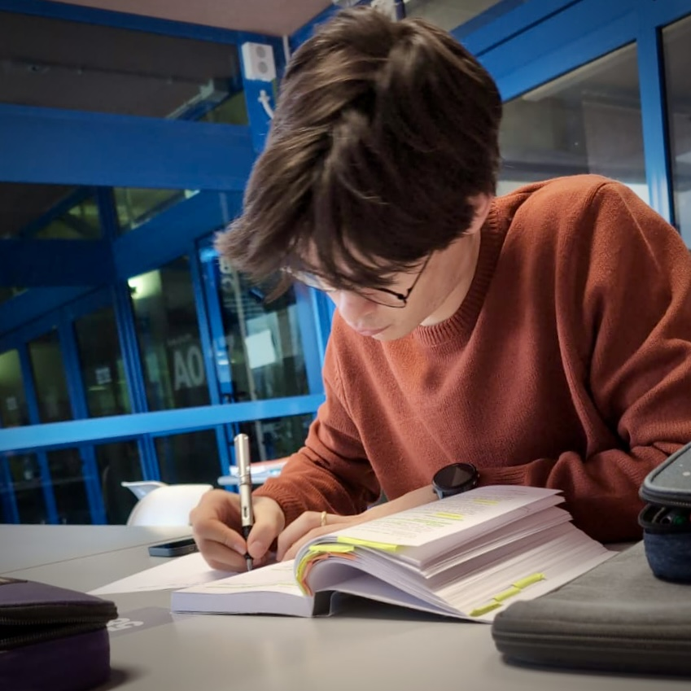

+++
title = "Su di me"
date = "2026-03-29"
type = "page"
math = true
+++

Ciao, Sono **Tommaso Ulian**!

Attualmente, sono al secondo anno del corso di Laurea in **Matematica** presso l'Università degli Studi di Udine, e sono inoltre allievo del selettivo programma d'eccellenza della **Scuola Superiore Di Toppo - Wassermann**. Il mio focus di studio primario verte su algebra, teoria dei numeri e geometria.

## Contatti

Sentiti libero di darmi una voce sui seguenti canali:
- ✉️ **Email:** [tommasoulian05@gmail.com](mailto:tommasoulian05@gmail.com)
- 💼 **LinkedIn:** [@TommasoUlian](https://www.linkedin.com/in/TommasoUlian)
- 🐙 **GitHub:** [@uliantommaso](https://github.com/uliantommaso)
